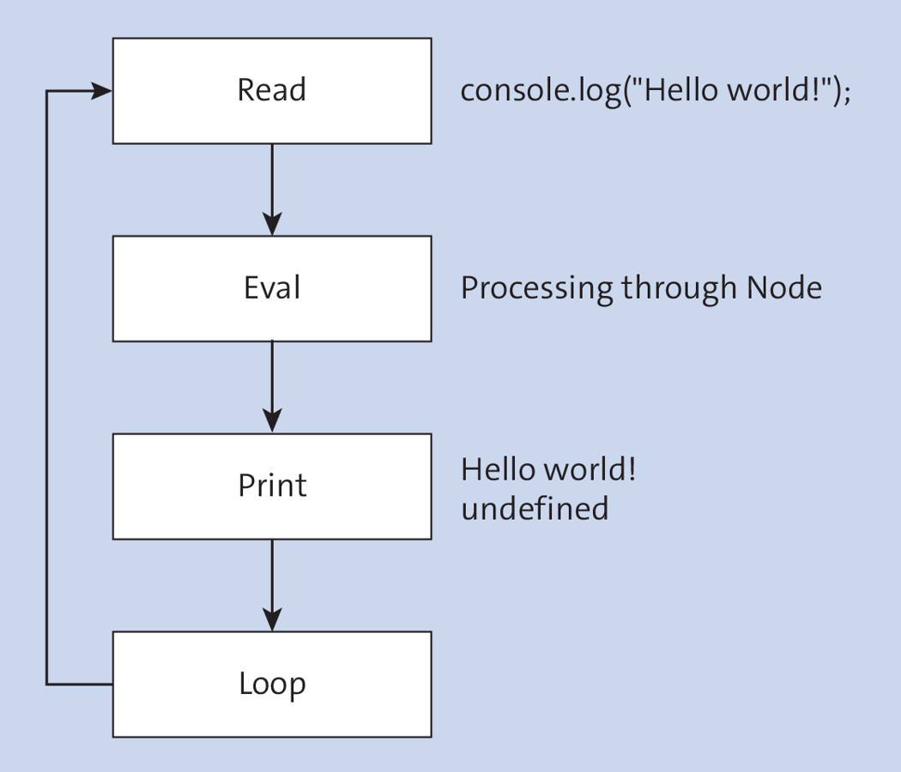
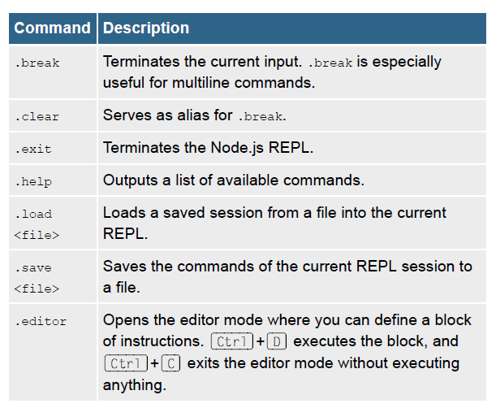

# [🏠 Home Page](../../readme.md)

- [🏠 Home Page](#-home-page)
- [3 Developing Your First Application](#3-developing-your-first-application)
  - [3.1 Interactive Mode](#31-interactive-mode)
    - [3.1.1 General Use](#311-general-use)
    - [3.1.2 Other REPL Commands](#312-other-repl-commands)
    - [3.1.3 Saving and Loading in the REPL](#313-saving-and-loading-in-the-repl)
    - [3.1.4 Context of the REPL](#314-context-of-the-repl)
    - [3.1.5 REPL History](#315-repl-history)
    - [3.1.6 REPL Mode](#316-repl-mode)
    - [3.1.7 Searching in the REPL](#317-searching-in-the-repl)
    - [3.1.8 Asynchronous Operations in the REPL](#318-asynchronous-operations-in-the-repl)
  - [3.2 The First Application](#32-the-first-application)

# 3 Developing Your First Application

By the time you get here, you should already have a working
installation of the Node.js platform on your system. To run the
examples in this chapter, you must use the command line of your
operating system. It doesn’t matter whether you use Windows, Linux,
or macOS. The examples work independently of the operating
system. You can use Node.js in two different ways. For simple
experiments, you can use the interactive shell. Alternatively, you can
run an application by passing the name of the initial file to the node
command. In this case, no further user interaction is usually
required.

## 3.1 Interactive Mode

You can reach the interactive mode of Node.js, as you can see in
`Listing 3.1`, by entering the node command in the command line.

**Listing 3.1**

```bash
➜  Node. js - Springer, Sebastian git:(master) node
Welcome to Node.js v16.14.0.
Type ".help" for more information.
> 
```

In interactive mode, you can directly enter JavaScript code on the
command line and execute it. This type of user interface is referred
to as read-eval-print loop (REPL), which means that commands are
read on the command line and evaluated, and then the result is
output on the command line. The mode isn’t intended to implement
and run complete applications. Instead, this interface of Node.js is
used to test the behavior and functionality of individual code
snippets. Figure 3.1 shows how the interactive mode works.



### 3.1.1 General Use

Listing 3.2 shows how you can issue commands in the Node.js
REPL.

**Listing 3.2 Executing Commands in the Node.js REPL**

```bash
➜  Node. js - Springer, Sebastian git:(master) node
Welcome to Node.js v16.14.0.
Type ".help" for more information.
> console.log("hello world")
hello world
undefined
```

The JavaScript commands also end with a semicolon in the Node.js
REPL. A line break ends the input of the current command and
sends the command to the JavaScript engine. In the example, the
`console.log` method with the `Hello World!` argument is evaluated,
and the `Hello World!` result is output to the command line. As you
can see in Listing 3.2, the value `undefined` is output in addition to the
expected `Hello World!`. This is because the return value of the
console.log function is represented; in this case, it’s `undefined`.
Apart from executing output, in REPL, you can also execute all
JavaScript commands available under Node.js, as shown in
Listing 3.3

**Listing 3.3 Definition of a Simple Node.js REPL Function**

```bash
> function greet(name) {
... console.log(`Hello ${name}`);
... }; greet('world');
Hello world
undefined
>
```

`Listing 3.3` shows how to define a function in Node.js REPL that gets
a name as a parameter and how to output it to the console as the
function progresses. After the definition, the function `greet` is called
with the argument `world` as name. The output consists of `Hello world`
and `undefined`. If you want to run different commands in the Node.js
REPL that build on each other, you can easily do so because the
context is preserved within a session. For example, if you define
functions or perform a variable assignment, these will be preserved
even after the command line is evaluated. In Listing 3.4, you can see
how this works in concrete terms.

**Listing 3.4 Interdependent Command Lines**

```bash
> const sayHello = "HI"
undefined
> console.log(sayHello)
HI
undefined
>
```

In the example in Listing 3.4, you assign a value to the `sayHello`
constant. This constant is used again in the output in the subsequent
statement. Among the most important features of the Node.js REPL
is the auto-completion function. If you press the (Tab) key without
entering anything else, you’ll get a list of all available objects. If you
use the auto-complete function in conjunction with one or more
letters, only the matching suggestions will be displayed. Another
feature worth mentioning is the multiline commands. As you can see
in Listing 3.3, the function code isn’t entered on a single line but on
several lines. An uncompleted command is indicated by three dots
instead of the greater-than sign as the command prompt. Multiline
commands can be achieved, for example, by unfinished code blocks
or a plus operator for calculation or string concatenation at the end of
the line.

### 3.1.2 Other REPL Commands

One of the special features of the Node.js REPL is that it provides
you with a few more commands to control the REPL in addition to
the JavaScript command set. The commands always start with a
period and don’t have to end with a semicolon. Table 3.1 contains an
overview of these commands.



There are two options available to exit the REPL: using the .exit
command or pressing (Ctrl)+(D), which will also terminate the
process immediately. Alternatively, you can press (Ctrl)+(C) twice.

The .break and .clear commands are used when the command line
is blocked by incorrect input. Listing 3.5 shows a use case for these
commands.

use of .break

```js
function greet(name) {
.. .break
```

In the example in Listing 3.5, you’ve started to formulate a function,
but you don’t want to finish writing it, you would rather cancel the
entry. You can’t terminate the current input by pressing the (Enter)
key, as this would merely insert a line break. If you find that you’ve
made a similar mistake in your input, you can terminate the current
input by using the .break command and enter your command again.
The same effect can be achieved via the shortcut (Ctrl)+(C). The
Node.js REPL provides the option to navigate through the history of
the most recent commands. With this feature, you don’t have to
retype your command, but you can use the (Up) and (Down) arrow
keys to navigate through the history of entered commands, retrieve
the corresponding command line, correct it, and enter it again.

### 3.1.3 Saving and Loading in the REPL

If you want to run more extensive tests in REPL or record the results,
you can use the .save and .load commands to save the previously
executed commands to a file or load a file with JavaScript
instructions into the current REPL.

Listing 3.6 shows how you can use the .load and .save commands.
To illustrate their usage, you should first enter the console.log
command. After that, the current session is saved to the myShell.js
file. This file then contains the command line as you entered it in the
REPL, but not the associated output. Next, you must load this file
back into the session using the .load statement. The file is read line
by line, each command is executed, and the corresponding output
gets displayed. You can also use the .load command to prepare a
specific initial situation for an experiment. For this purpose, you can
formulate a set of commands in a file, for example, to define
variables or functions that you need in the course of a session in the
Node.js REPL.

```bash
➜  Node. js - Springer, Sebastian git:(master) ✗ node
Welcome to Node.js v16.14.0.
Type ".help" for more information.
> const x = 12;
undefined
> .save myShell.js
Session saved to: myShell.js
> console.log("hello world")
hello world
undefined
> const w = 12;
undefined
> .save
Failed to save:
> .save myShell.js
Session saved to: myShell.js
```

we can see the file.

```js
const x = 12;
console.log("hello world")
const w = 12;
```

### 3.1.4 Context of the REPL

As is common in JavaScript, the Node.js REPL provides a global
context that you can access anywhere in your program. In the REPL,
some variables are already registered at the beginning in this global
context, which facilitate your work as a developer. This way, all
Node.js core modules are available to you without having to load
them separately via the module system. For example, you can use
http.STATUS_CODES to print the predefined list of HTTP status codes.
Besides these modules, you can load files or Node Package
Manager (npm) packages via the module system by using the
require function. In the global scope of the Node.js REPL, the _
variable provides you with another special feature: this variable
always contains the value of the most recent command. For
example, if you enter the command 1 + 1,_ will contain the value 2
afterwards. If you call a method such as process.uptime(), _
contains its return value afterwards.

### 3.1.5 REPL History

The Node.js REPL has some special environment variables. Two of
them concern historicizing entries. You probably already know this
feature from the command prompt of your operating system. In the
case of Bash on Unix systems, there is a file called .bash_history,
which stores all the commands that were entered. A similar
functionality exists for the Node.js REPL. In the default configuration,
the input is stored in the .node_repl_history file in the user’s root
directory. You can use two environment variables from your
operating system to control the history functionality. With
NODE_REPL_HISTORY, you can change the location of the history. If no
value is specified, the default is used. The second environment
variable, NODE_REPL_HISTORY_SIZE, determines how many lines the
history file can hold before overwriting older commands. The default
value is 1000.

### 3.1.6 REPL Mode

You can use the NODE_REPL_MODE environment variable to determine
in which mode you want to run the Node.js REPL. The three possible
values are as follows:

**sloppy**

- The REPL is set to nonstrict mode. The rules of JavaScript strict
mode are overridden. This is the default mode for running the
REPL.
**strict**
- The strict value activates the strict mode. In this case, for
example, you can no longer create multiple properties with the
same name in an object, and changing a constant returns an
error. A very good and detailed description of the strict mode can
be found at <https://developer.mozilla.org/en>-
US/docs/Web/JavaScript/Reference/Strict_mode.

**magic**
This value is now deprecated and is used as an alias of sloppy.

You can also run Node.js directly in strict mode via the --use_strict
command-line option. In most cases, this makes sense because you
can save the use strict specifications, and strict mode prohibits
many antipatterns in JavaScript.

Using the Node.js REPL as a tool, you can easily test source code to
interactively see how the Node.js platform behaves in certain
situations. The Node.js REPL isn’t suitable for extensive
applications. In this case, a different way of running Node.js is used.

### 3.1.7 Searching in the REPL

The Node.js REPL allows you to not only navigate within the history
using the arrow keys, but also to search for specific lines. You can
use (Ctrl)+(R) and (Ctrl)+(S) to perform backward and forward
search runs in the history.

You access this feature mainly when you want to execute a certain
line again but don’t want to enter it a second time. The search finds
the entered code whether it occurs at the beginning or anywhere
within the line. A found match is displayed at the command prompt,
and you have the option to adjust the code and then execute it by
pressing the (Enter) key. If a certain text is found several times, you
can jump to the next hit by pressing the respective shortcut again or
go to the previous hit by pressing the other shortcut.

### 3.1.8 Asynchronous Operations in the REPL

JavaScript provides various means of handling asynchrony, such as
callbacks or promises. A few years ago, the async-await concept
was introduced, which will be discussed in greater detail later in this
book. You can use the await keyword to wait for an asynchronous
operation without registering a callback function. The engine pauses
the execution of the current code block until the result is available.
The rest of the application remains responsive and can continue its
work undisturbed.

Normally, you must mark a function in which you want to use the
await keyword with the async keyword. Newer versions of the
ECMAScript standard provide for a feature called top-level await,
which allows you to use await even at the top level of your
application and thus without a surrounding async function. This
feature is also available in the Node.js REPL, and, since version
16.6, it’s also enabled by default and no longer hidden behind the --
experimental-repl-await flag.

Listing 3.7 shows the example of a promise object created with
Promise.resolve to demonstrate how you can launch REPL with the
--experimental-repl-await option and how you can use the await
keyword. Promise.resolve is one of the simplest ways to simulate an
asynchronous operation by creating a promise object and resolving it
immediately.

**Using a Top-Level Await in the REPL**

```bash
$ node
Welcome to Node.js v16.8.0.
Type ".help" for more information.
> await Promise.resolve('Hello world');
'Hello world'
```

## 3.2 The First Application

###

###

###

###
